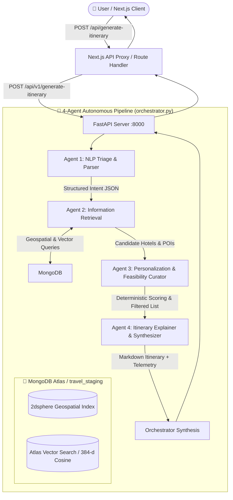

# 🌴 Ceylon Travel-Tech Agentic AI — Backend Architecture & Service Documentation

A production-grade, 4-agent autonomous pipeline orchestrating natural language trip planning, geospatial information retrieval, personalized multi-dimensional ranking, and generative day-by-day travel synthesis across Sri Lanka.

---

## 🏛️ System Architecture



---

## 🚀 How to Run the Backend

### 1. Installation & Setup
```bash
# Navigate to the backend directory
cd backend

# Install Python dependencies
pip install -r requirements.txt
```

### 2. Launch FastAPI Server
```bash
# Run server with hot-reload enabled
uvicorn main:app --reload --host 0.0.0.0 --port 8000
```
Interactive Swagger API documentation is available at:
`http://localhost:8000/docs`

---

## 🔄 How to Run the Automated Data Pipeline (ETL)

The automated ETL runner runs all four data preparation phases sequentially:
1. `db/cleaner.py` — Schema validation, currency normalization, HTML stripping, spatial deduplication.
2. `db/feature_engineering.py` — Amenity flags, price tiers, 5km POI density, nearest airport baseline.
3. `db/vectorizer.py` — Computes 384-dimensional dense vector embeddings using `all-MiniLM-L6-v2`.
4. `db/rag_validator.py` — Comprehensive audit validating 100% RAG readiness.

```bash
# Run from repository root or backend folder
python backend/pipeline/etl_runner.py

# Optional: Run with auto-repair enabled
python backend/pipeline/etl_runner.py --fix
```

---

## ⚙️ Required Environment Variables

Set these in your root `.env` or `backend/.env`:

| Variable | Description | Example / Default |
|---|---|---|
| `MONGODB_URI` | MongoDB Atlas connection string for main database | `mongodb+srv://...` |
| `webscrape_URI` | MongoDB connection string for raw scraper database | `mongodb+srv://...` |
| `GOOGLE_API_KEY` | Google Gemini API key for Agent 1 and Agent 4 | `AIzaSy...` (Optional, fallback provided) |
| `OPENAI_API_KEY` | Alternative OpenAI API key | `sk-...` (Optional) |
| `NEXT_PUBLIC_AGENT_API_URL` | Base URL of FastAPI backend for Next.js frontend | `http://localhost:8000` |
| `LOG_LEVEL` | Python logging level | `INFO` |

---

## 📡 Sample API Request & Response

### Request (`POST /api/v1/generate-itinerary`)
```bash
curl -X POST "http://localhost:8000/api/v1/generate-itinerary" \
  -H "Content-Type: application/json" \
  -d '{
    "destination": "Galle",
    "travel_dates": "December 10-15, 2026",
    "duration_days": 5,
    "budget_usd": 450.0,
    "party_size": 3,
    "interests": ["Beach", "Historical"],
    "custom_vibe": "Clean hotel near Galle Fort, not too far from the beach"
  }'
```

### Response (`200 OK`)
```json
{
  "itinerary": "# 🌴 Your Sri Lanka Itinerary: Galle (5 Days)\n\n## Overview\n...",
  "hotels": [
    {
      "name": "The first lane villa",
      "price_usd": 16.0,
      "price_tier": "Budget",
      "star_rating": "4 stars",
      "curator_score": 82.5
    }
  ],
  "pois": [
    {
      "name": "Clippenburg Bastion",
      "intent_tags": ["Beach", "Historical"],
      "popularity_index": 0.92
    }
  ],
  "estimated_total_usd": 145.0,
  "budget_warning": false,
  "reasoning": {
    "The first lane villa": {
      "budget_fit": 28.5,
      "amenity": 15.0,
      "rating": 12.0,
      "density": 18.0,
      "total": 82.5
    }
  },
  "agent_timings": {
    "agent1_triage_s": 2.03,
    "agent2_ir_s": 1.83,
    "agent3_curator_s": 0.01,
    "agent4_guide_s": 2.36
  }
}
```

---

## 🔍 MongoDB Atlas Vector Search Setup (Manual Step)

To enable hardware-accelerated Vector Search in MongoDB Atlas for Agent 2:

1. Log in to your **MongoDB Atlas Console**.
2. Select your cluster and navigate to the **Atlas Search** tab.
3. Click **Create Search Index** and choose **Atlas Vector Search (JSON Editor)**.
4. Select database: `travel_staging`, collection: `staged_hotels`.
5. Enter the following index definition:
```json
{
  "fields": [
    {
      "type": "vector",
      "path": "embedding",
      "numDimensions": 384,
      "similarity": "cosine"
    }
  ]
}
```
6. Set Index Name to: `hotel_vector_index` and click **Create Search Index**.
7. Repeat the same steps for collection `staged_places` with Index Name: `places_vector_index`.

*(Note: If Atlas Vector Search index is not yet built, Agent 2 automatically falls back to in-memory cosine similarity search seamlessly).*
